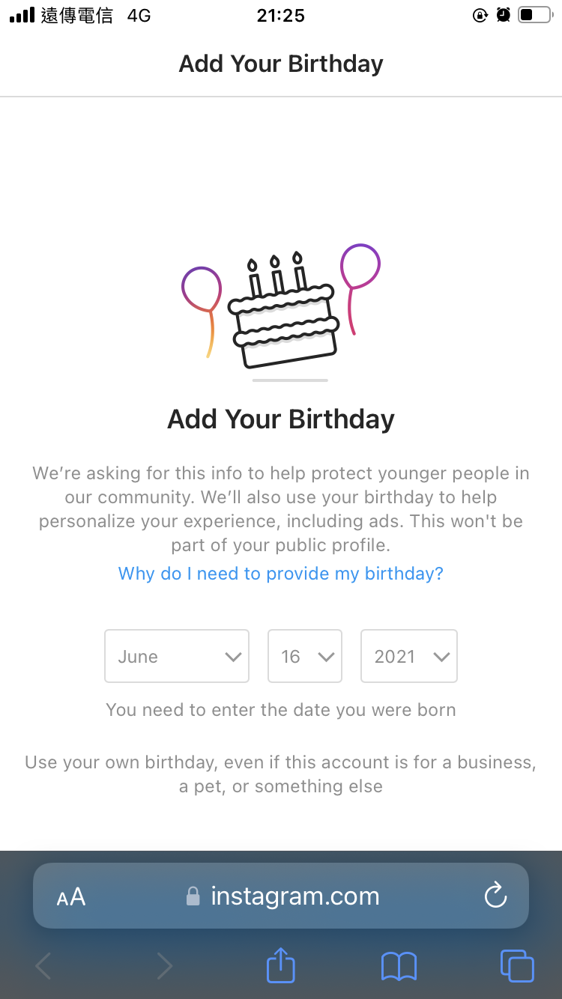

## 該從哪裡開始呢？
一直想遠離 Instagram，從來沒有完全戒斷。但這次它要求了我的生日，並且用了如此冠冕堂皇的理由

<!-- truncate -->

（我還沒研究出更改圖片大小的方法，將就將就）

也一直想寫 blog，紀錄學習和生活。由於前端知識不足，遲遲沒有開始，剛好看到這個框架。說來慚愧，這是 facebook 所開源的專案，感覺有點奇怪。

最近在看《數位時代的人權思辨》，還沒看完。有時會想找人討論，但可惜沒有足夠的網頁能力能讓我建置可以留言的網頁。

## 關於自我
我還沒寫關於這個標題的頁面，先放在這了。

