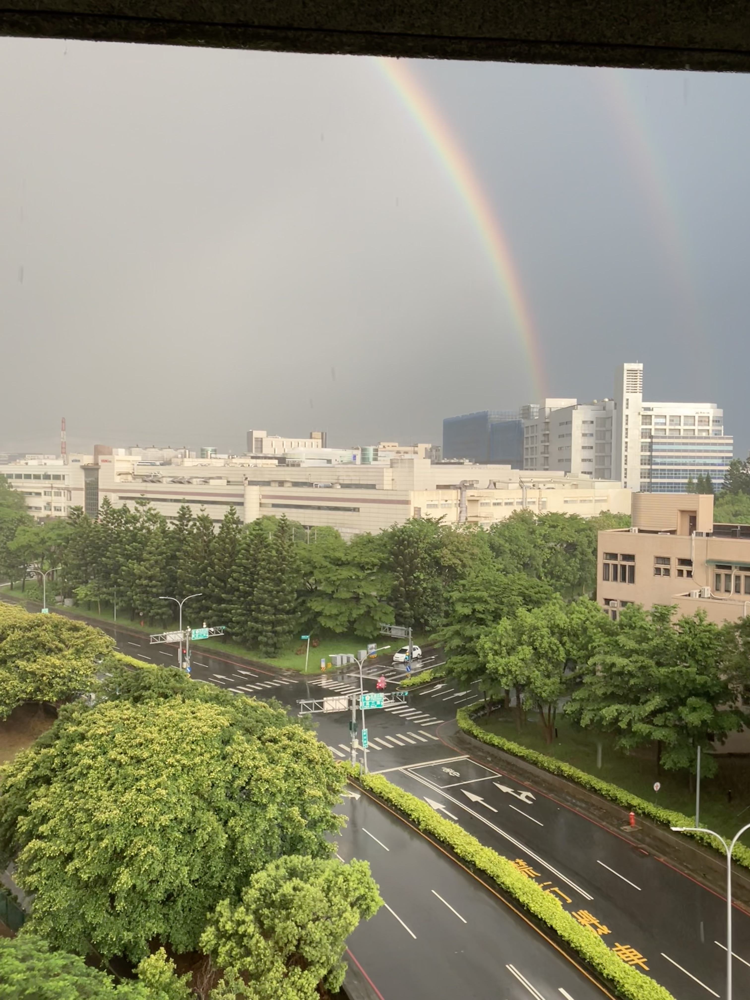

我喜歡上了所有季節。

<!-- truncate -->

我沒想到我會這樣無可救藥地開始喜歡夏天。
我選不出我最喜歡的季節了。

夏天充滿了聲音。
蟬聲，高低起伏的唧唧聲、鳥叫聲、松鼠的聲音，也許牠在跟鳥兒講話；
雨聲，滴上葉片的答答聲、風吹聲、草地的聲音，也許是雨也許是風。

最近又讀了幾遍《再別康橋》，他寫得如此浪漫。莫名成為我喜歡上夏天的契機，又或許，它只是讓我發現。
我有了一個夏天歌單，說不定沒有那麼夏天，卻有了我的美好夏天。

我感受到它的活力，即便我沒見到蟬的形體。可能我還少了些花。大概就是這樣絢爛又叫人迷惑，就是一個適合錯過的季節。
適合小溪、適合藍綠黃紅。

