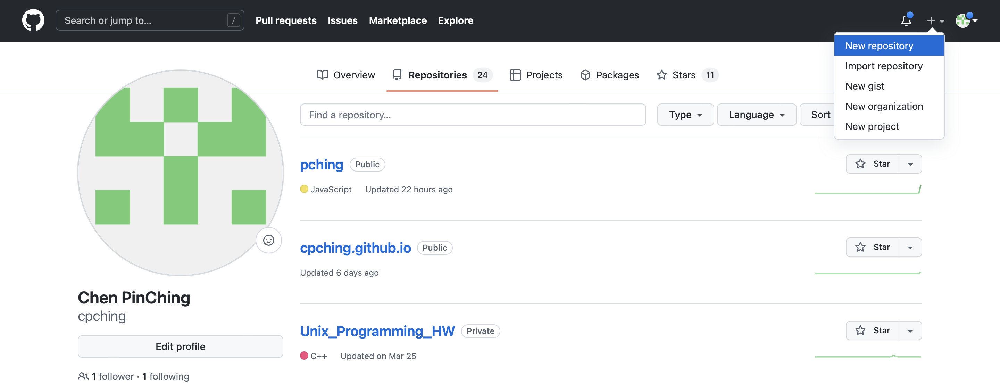
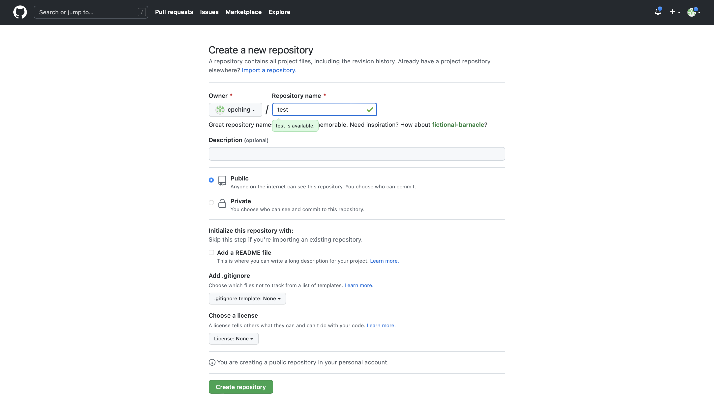
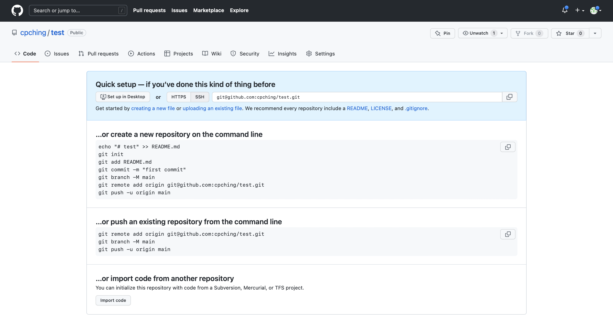
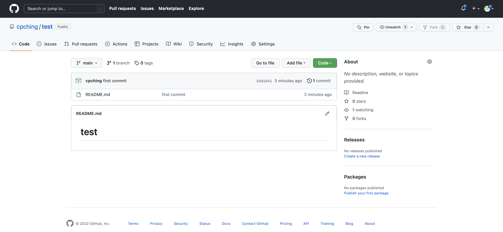
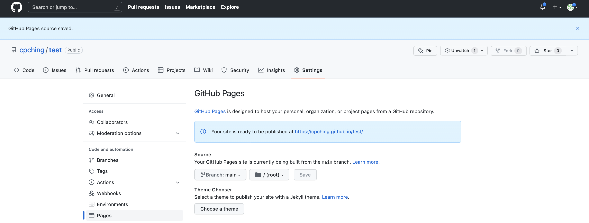

# Github
先講講什麼是 GitHub 好了。你可能聽過 Git，一個版本管理軟體；而 Github 是個線上的 Git Server，就是可以把程式碼放到上面，並利用 Git 做版本管理。
當你的專案只需要在本地端撰寫、使用，那其實不需要 Github，那為什麼我們需要 Github 呢？
有很多有道理的原因，可以當作備份、可以多人協作。
或許需要記住，GitHub 跟 Git 不同。

# 靜態網頁
要講 GitHub Pages 需要講靜態和動態網頁的差別。
- 靜態網頁：由 HTML/CSS/JavaScript 組成
    1. 使用者向 server 發出請求
    2. server 回應
    3. 使用者的瀏覽器渲染出頁面
- 動態網頁：有不同的程式語言，通常會有資料庫
    1. 使用者向 server 發出請求
    2. server 在內部呼叫相關程式處理該請求
    3. server 回應
    4. 使用者的瀏覽器渲染出頁面
    
# GitHub Pages
### What is it?
通常，我們想要把網站公開讓大家能夠看到需要把網站放在 server 上，可能是租一台或是自己架一台。
也可以用免費空間之類的，但還要處理 domain 名字等麻煩的問題。
GitHub Pages 解決了一小部分，它讓我們可以把靜態網站在它身上呈現。

### How to do?
首先，需要有個 GitHub 帳號，在 [GitHub](https://github.com) 註冊。
你所取的 username 將會是你的 GitHub Pages 網址的一部分。放心，它可以再被更改，但不能跟別人重複。

再來，建立一個新的 repository（如果不知道什麼是 repository 可能要找 git 的教學或是等我寫）。


右上角的 New repository 按下去，可以簡單寫下 Repository name，選擇 [Public]。



然後按下綠色的 Create repository 按鈕，就獲得的了新的線上 repository。



讓我們回到終端機，建立一個空資料夾`mkdir test`，並移動到裡面（`cd test`）。
接著把剛剛 GitHub 上第一塊指令
``` shell
echo "# test" > README.md
git init
git add README.md
git commit -m "first commit"
git branch -M main
git remote add origin git@github.com:cpching/test.git
git push -u origin main
```
全部貼到終端機上執行。

回到 GitHub 頁面重新整理發現，



接著點選 `setting`，找到 `Pages`，將 `Branch` 調整至 `main` 後按下 `save`。



你就可以透過 https://[username].github.io/test/ 存取這個專案。

